# Erasmus Opportunities - Hybrid Mobile App

This app helps volunteers find erasmus plus opportunities. Browse, filter, apply, all in one platform.

#### This app includes:
- [Home](#home)
- [Filters](#filters)
- [Map View](#map-view)
- [Information Page](#information-page)
- [Account](#account)

### Home

In the home tab volunteers can view, filter, favour and apply to opportunities.

[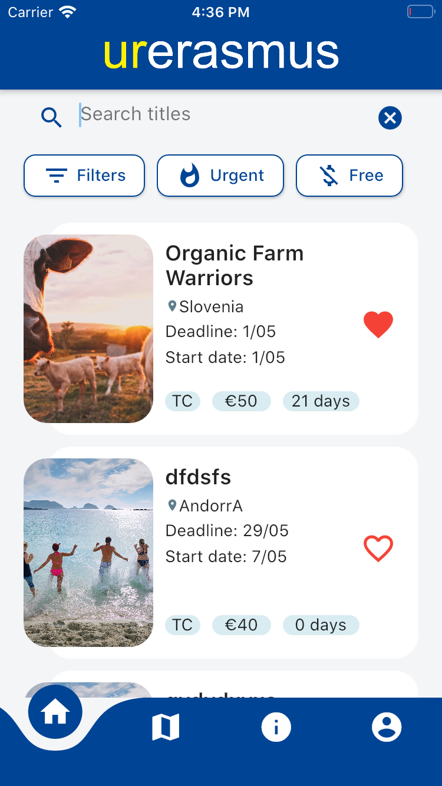](readMe/list_after.png)
[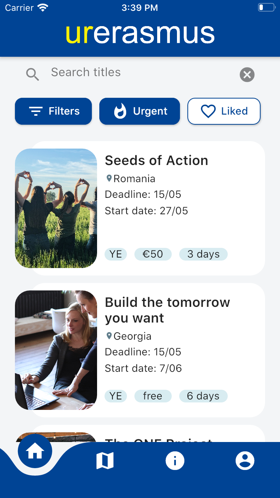](readMe/opportunity_list_shortcuts.png)
[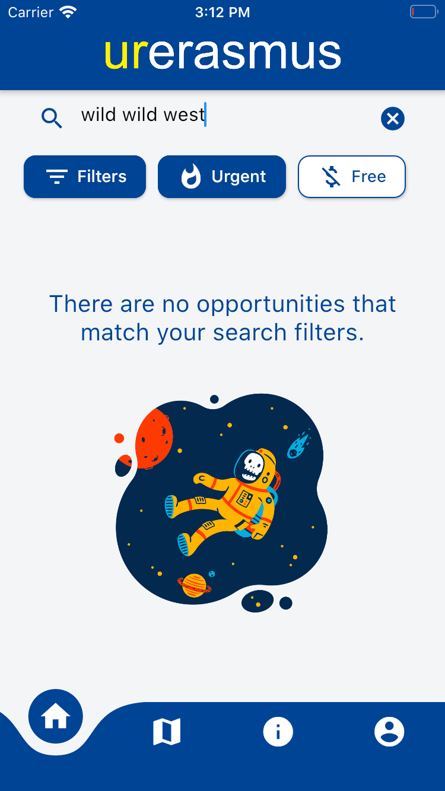](readMe/no_opportunities_found.png)

[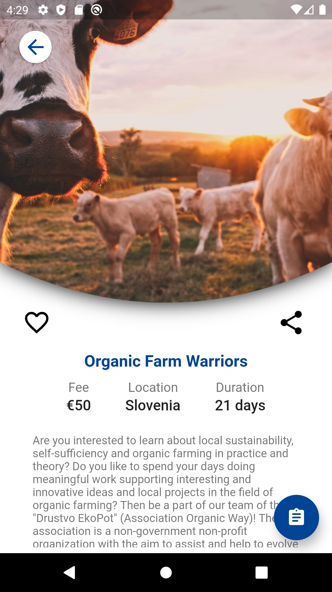](readMe/top_after.png)
[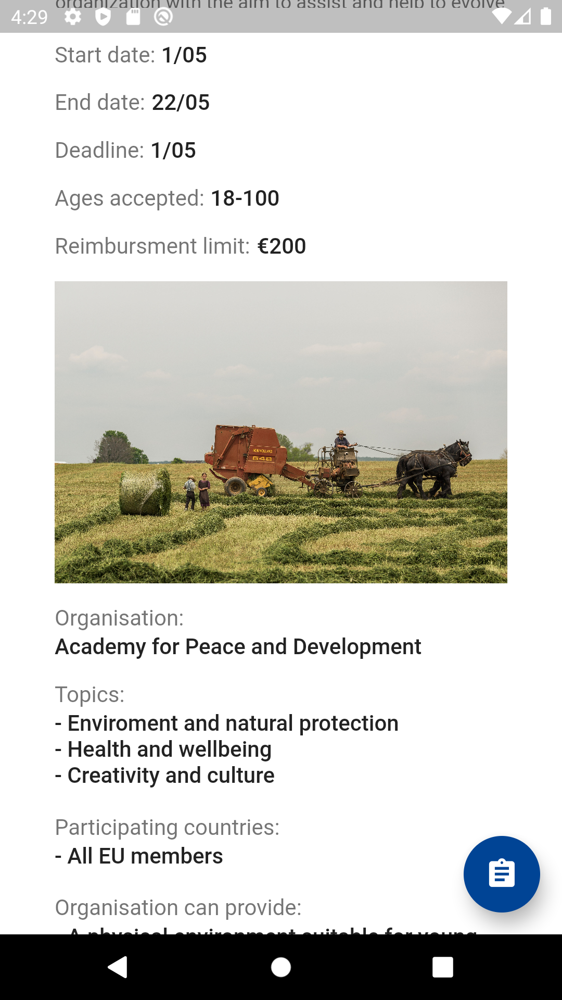](readMe/middle_after.png)
[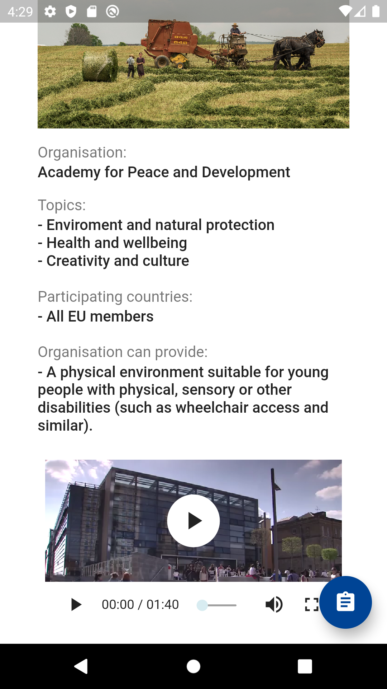](readMe/bottom_after.png)

### Filters

Extensive filters were added for maximum eficiency when searching.

[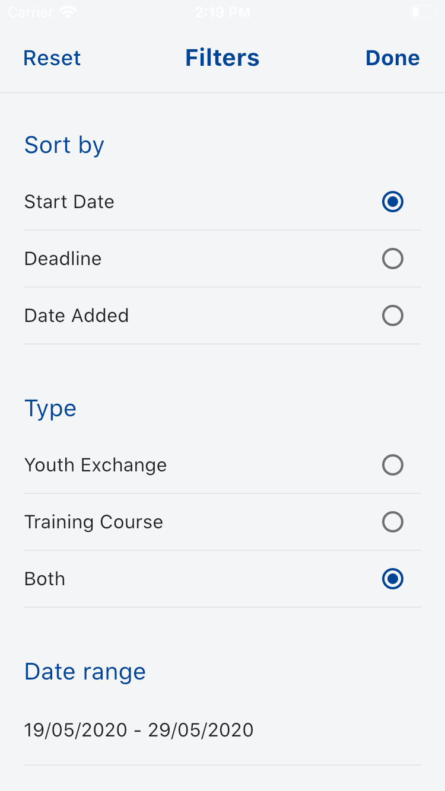](readMe/filters1.png)
[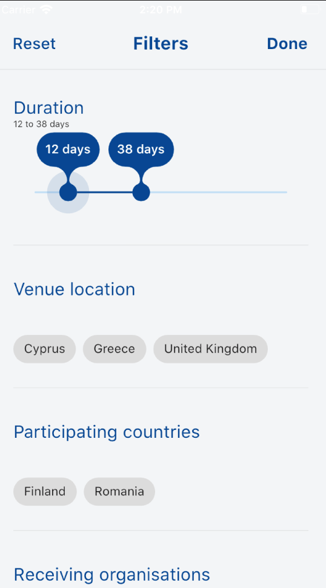](readMe/filters2.png)
[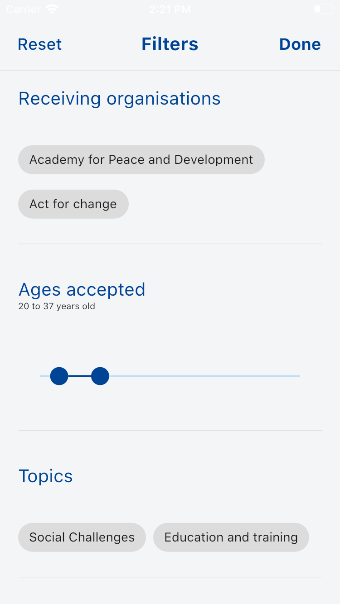](readMe/filters3.png)
[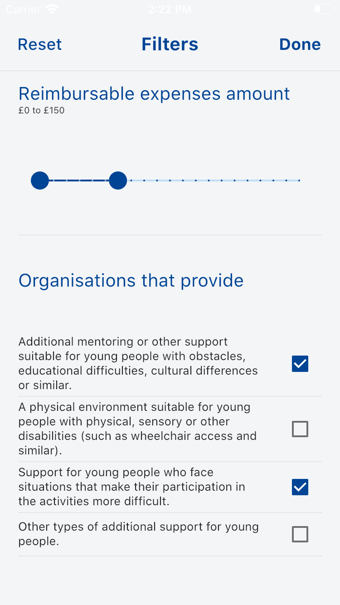](readMe/filters4.png)

### Map View

Map view to aid searching.

[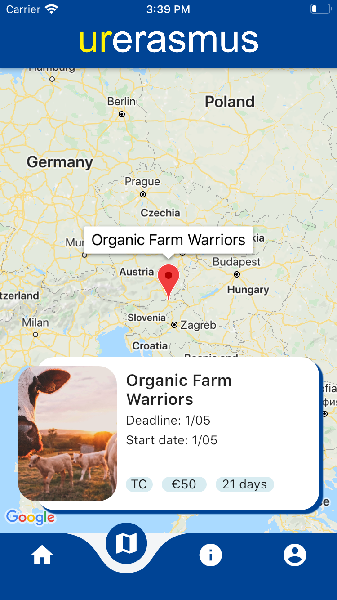](readMe/app_map.png)

### Information Page

Information for first time volunteers.

[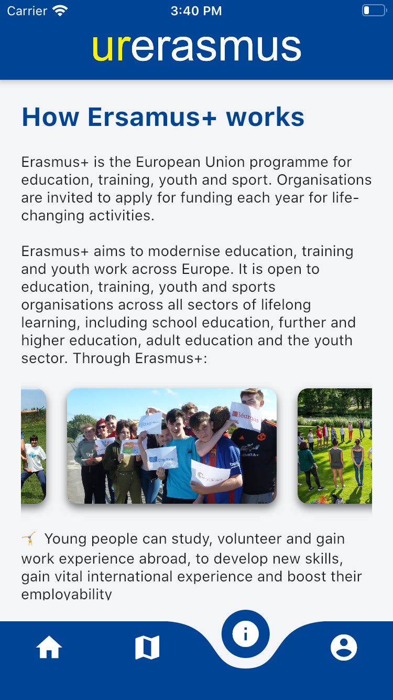](readMe/app_info.png)

### Account

Volunteers account, where they can keep track of liked opportunities.

[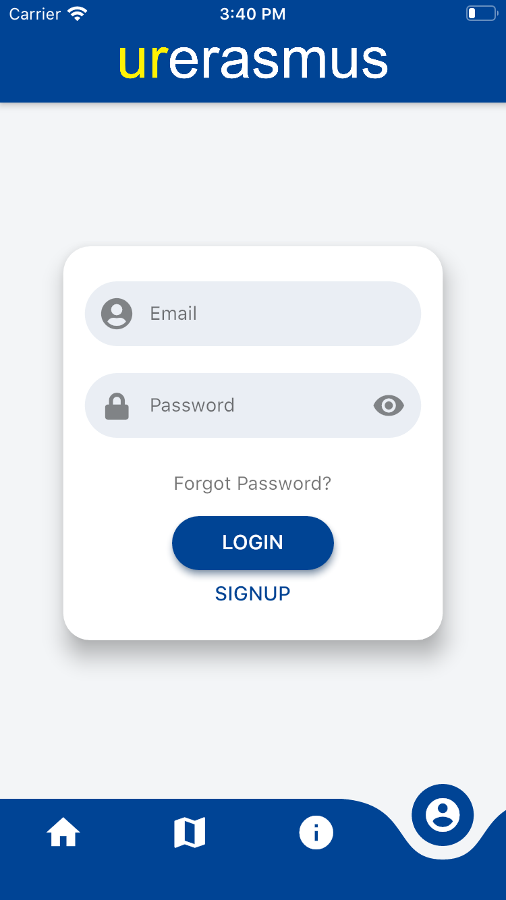](readMe/app_account.png)
[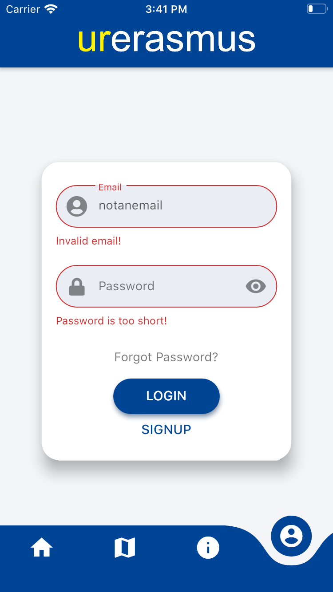](readMe/signup_error_messages.png)

[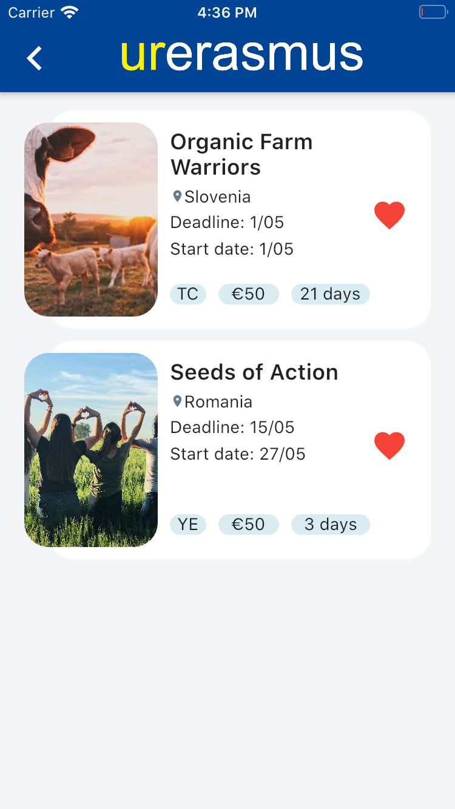](readMe/account_after.png)

#### Open source libraries used:

- [flutter_login 1.0.14](https://pub.dev/packages/flutter_login)
- [flutter_multiselect 0.4.0](https://pub.dev/packages/flutter_multiselect#-readme-tab-)
- [transformer_page_view 0.1.6](https://pub.dev/packages/transformer_page_view)
- [flushbar 1.10.2](https://pub.dev/packages/flushbar)
- [image_picker_web 1.0.8](https://pub.dev/packages/image_picker_web)
- [flip_card 0.4.4](https://pub.dev/packages/flip_card)
- [flutter_form_builder 3.9.0](https://pub.dev/packages/flutter_form_builder)
- [flutter_progress_button 1.0.0](https://pub.dev/packages/flutter_progress_button)
- [curved_navigation_bar 0.3.2](https://pub.dev/packages/curved_navigation_bar)
- [dart_random_choice 0.0.2](https://pub.dev/packages/dart_random_choice)
- [url_launcher 5.4.5](https://pub.dev/packages/url_launcher)
- [flutter_focus_watcher 0.0.1](https://pub.dev/packages/flutter_focus_watcher)
- [flutter_statusbarcolor 0.2.3](https://pub.dev/packages/flutter_statusbarcolor)
- [chewie 0.9.10](https://pub.dev/packages/chewie)
- [video_player 0.10.10](https://pub.dev/packages/video_player)
- [google_maps_flutter 0.5.27+1](https://pub.dev/packages/google_maps_flutter)
- [geocoder 0.2.1](https://pub.dev/packages/geocoder)
- [share 0.6.4+1](https://pub.dev/packages/share)
